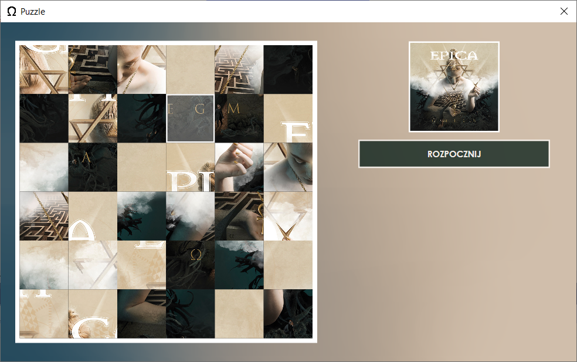

# Puzzle
Puzzle is a simple puzzle application created with Windows Presentation Foundation (WPF).

## Table of contents
* [Technology](#technology)
* [Screenshots](#screenshots)

## Technology
Project is created with:
* .NET 6.0
* Windows Presentation Foundation (WPF)
* C#
* XAML

## Screenshots

    
    <em>Game</em>

